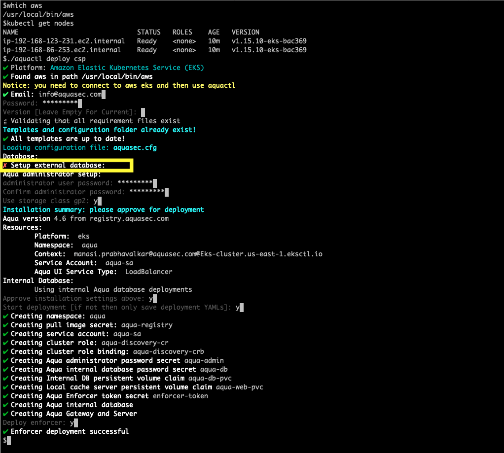
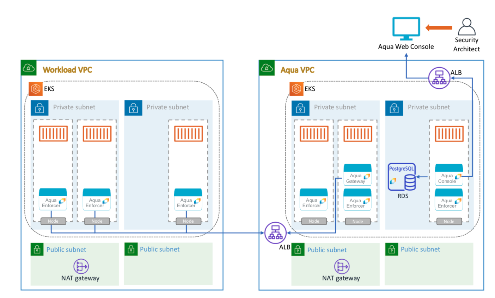
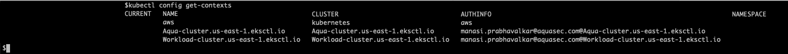

# Aqua Cloud Native Security Platform (CSP) for Amazon EKS
Before you begin, make sure you have a AWS Marketplace Subscription to the [Aqua CSP EKS offer.](https://aws.amazon.com/marketplace/pp/B07KCNBW7B)

Aqua EKS BYOL listing enables you to add security capabilities to your existing cloud-native workloads on EKS cluster environment. Aqua replaces outdated signature-based approaches with modern controls that leverage the cloud-native principles of immutability, microservices and portability.

Installation is simple, as Cloud Native apps should be! There are minimal prerequisites to attend to in order to deploy Aqua CSP on Amazon EKS as defined below.

Many other installation variations are available to customers with an `https://my.aquasec.com` account. Cloud Marketplace specific documentation is located at `https://cloud-market-docs.aquasec.com`

## Contents

- [Prerequisites](#Prerequisites)
  - [EKS cluster](#1-EKS-cluster-environment)
  - [AWS CLI](#2-Install-AWS-CLI)
  - [Aqua License](#3-Aqua-license-and-registry-credentials)
  - [Aquactl](#4-Install-Aquactl)
  - [Database deployment](#5-database-options)
- [Deployment scenarios](#deployment-Scenarios)
  - [Scenario 1: Getting started with Aqua](#Scenario-1-Getting-started-with-Aqua)
  - [Scenario 2: Production EKS Cluster](#Scenario-2-Production-EKS-Cluster)
  - [Scenario 3: Production EKS Multi-Cluster](#Scenario-3-Production-EKS-Multi-Cluster)
- [Verify Deployment](#verify-deployment)
- [Post-deployment tasks](#post-deployment-tasks)
    - [Backup Auto-Generated Secrets](#1-backup-auto-generated-secrets)
    - [Obtain the Aqua Command Center administrator password](#2-obtain-the-aqua-command-center-administrator-password)
    - [Obtain the Aqua Command Center web URL](#3-obtain-the-aqua-command-center-web-URL)
    - [Enter the license to enable the product](#4-Enter-the-license-to-enable-the-product)
    - [Verify the Aqua installation](#5-Verify-the-Aqua-installation)
- [Re-deploying Aqua CSP](#Re-deploying-Aqua-CSP)
  - [PostgreSQL instructions](#PostgreSQL-instructions)
- [Uninstalling Aqua CSP](#Uninstalling-Aqua-CSP)
- [Support](#support)
- [Appendix](#appendix)

## Prerequisites

#### 1. EKS cluster environment
Aqua can be deployed on an existing EKS cluster to secure your running workload or you can choose to deploy Aqua on a separate EKS environment than that of the workloads.

#### 2. Install AWS CLI
```shell
pip install awscli --upgrade --user
```

#### 3. Aqua license and registry credentials
This installation needs an existing Aqua CSP license as well as the registry credentials to pull images from Aqua's private registry. If you do not already have them, please reach out to Aqua at [Cloud Sales](mailto:cloudsales@aquasec.com)

#### 4. Install Aquactl
Aquactl is a command-line tool that provides a wide variety of functionality related to Aqua CSP deployment and operation.
You can get the latest [aquactl](https://docs.aquasec.com/docs/aquactl-functions-and-usage#section-download-aquactl) binary and make it executable.

>Linux: https://get.aquasec.com/aquactl/stable/aquactl
>MacOS: https://get.aquasec.com/aquactl/mac/stable/aquactl

```shell
wget https://get.aquasec.com/aquactl/stable/aquactl
chmod +x aquactl
```

#### 5. Database Options

The aquactl deployment includes an Aqua provided PostgreSQL database container for small environments and/or testing scenarios. For production deployments Aqua recommends implementing a dedicated managed database such as Amazon RDS. Please refer to [RDS requirements](#1-rds-requirements)


## Deployment Scenarios 
All the scenarios need an EKS cluster to begin with. 

>Note: You can spin up a [new cluster](#3-create-an-EKS-cluster) easily using eksctl

### Scenario 1: Getting started with Aqua
This section is for you if you want to get started with Aqua and hit the ground running. Aqua in a box will allow you to have a sneak peak into Aqua's capabilities in securing your cloud-native workloads. All you need is an EKS cluster.

**<details><summary>Deployment Steps</summary>**

  ### Architecture Diagram
  

  ### Deployment instructions
  For testing purposes, the Helm chart installation provides a starter environment that includes a database container for Postgres. It utilizes a persistent volume in order to store the data. However, this architecture is not scalable or resilient enough for production workloads.

  >Note: For EKS clusters with Kubernetes version below 1.11 please refer to [storage class creation](#2-extend-eks-with-an-ebs-supported-storageclass)  

  #### 1. Access the EKS cluster
  Work on an existing EKS cluster or [spin up a new one](#3-create-an-EKS-cluster).
  Get the kubeconfig file
  ```shell
  eksctl utils write-kubeconfig --cluster=<name> [--kubeconfig=<path>][--set-kubeconfig-context=<bool>]
  ``` 

  Verify the node status
  ```shell
  kubectl get nodes
  ```

  #### 2. Deploy Aqua CSP
  The aquactl utility provides an interactive experience that allows you to configure the CSP installation
  ```shell
  aquactl deploy csp
  ```
  Here's an example of how the output looks like:
  

  #### 3. Verify Deployment
  You can verify the deployment by checking the aqua namespace on your EKS cluster. It might take several minutes for the External IP to get populated and the web interface to come live.
  ```shell
  $kubectl get deploy -n aqua
  NAME           READY   UP-TO-DATE   AVAILABLE   AGE
  aqua-db        1/1     1            1           18m
  aqua-gateway   1/1     1            1           18m
  aqua-web       1/1     1            1           18m
  
  $kubectl get ds -n aqua
  NAME         DESIRED   CURRENT   READY   UP-TO-DATE   AVAILABLE   NODE SELECTOR   AGE
  aqua-agent   2         2         2       2            2           <none>          40s

  $kubectl get svc -n aqua
  NAME           TYPE           CLUSTER-IP       EXTERNAL-IP                                                              PORT(S)                        AGE
  aqua-db        ClusterIP      10.100.239.123   <none>                                                                   5432/TCP                       18m
  aqua-gateway   ClusterIP      10.100.2.103     <none>                                                                   8443/TCP,3622/TCP              18m
  aqua-web       LoadBalancer   10.100.149.125   a8aa7af13b602467bb18161ab7c75d8e-340274804.us-east-1.elb.amazonaws.com   443:31254/TCP,8080:31209/TCP   18m
```
</details>

### Scenario 2: Production EKS Cluster
This section is for you if you want to run Aqua in a production EKS cluster. It can be an existing cluster or you can choose to Note: You can spin up a [new cluster](#3-create-an-EKS-cluster) easily using eksctl. 

A production-grade Aqua CSP deployment requires a managed Postgres database installation like Amazon RDS. [Click here](#1-RDS-requirements) for RDS requirements. (We also provide a CloudFormation template in the deployment instructions)

**<details><summary>Deployment Steps</summary>**
  ### Architecture Diagram
   

  ### Deployment instructions
  
  #### 1. Access the EKS cluster
  Work on an existing EKS cluster or Note: You can spin up a [new cluster](#3-create-an-EKS-cluster) easily using eksctl.
  Get the kubeconfig file
  ```shell
  eksctl utils write-kubeconfig --cluster=<name> [--kubeconfig=<path>][--set-kubeconfig-context=<bool>]
  ``` 
  
  #### 2. Create RDS instance
  Use this CloudFormation template to create a managed RDS Postgres instance for Aqua CSP. 

  [](https://console.aws.amazon.com/cloudformation/home?#/stacks/new?stackName=aqua-rds&templateURL=https://aqua-security-public.s3.amazonaws.com/AquaRDS.yaml)

  >Note the values for the RDS Endpoint URL and port from the CloudFormation Outputs

  #### 3. Deploy Aqua CSP
  The aquactl utility provides an interactive experience that allows you to configure the CSP installation
  ```shell
  aquactl deploy csp
  ```
  Here's an example of how the output looks like:
  

  #### 3. Verify Deployment
  You can verify the deployment by checking the aqua namespace on your EKS cluster. It might take several minutes for the External IP to get populated and the web interface to come live.
  ```shell
  $kubectl get deploy -n aqua
  NAME           READY   UP-TO-DATE   AVAILABLE   AGE
  aqua-gateway   1/1     1            1           4m43s
  aqua-web       1/1     1            1           4m43s

  $kubectl get ds -n aqua
  NAME         DESIRED   CURRENT   READY   UP-TO-DATE   AVAILABLE   NODE SELECTOR   AGE
  aqua-agent   2         2         2       2            2           <none>          40s
  
  $kubectl get svc -n aqua
  NAME           TYPE           CLUSTER-IP       EXTERNAL-IP                                                               PORT(S)                        AGE
  aqua-gateway   ClusterIP      10.100.195.172   <none>                                                                    8443/TCP,3622/TCP              4m45s
  aqua-web       LoadBalancer   10.100.3.114     a5fb4ba393f45469b85d838b1a9ff236-1141983764.us-east-1.elb.amazonaws.com   443:30176/TCP,8080:31309/TCP   4m45s
  ```
</details>

### Scenario 3: Production EKS Multi-Cluster
This section is for you if you have multiple EKS clusters in your environment and want to use Aqua as a single pane of glass solution to manage and secure all of them. 

Since now multiple cloud-native environments are communicating back to Aqua, the aqua-gateway component also has to be exposed along with the Web interface. Aquactl enables you to do that with an additional flag. Once Aqua CSP is deployed you can manage the other EKS clusters by installing an Aqua agent on them that can connect back to the Aqua control-plane. 

**<details><summary>Deployment Steps</summary>**
  
  ### Architecture Diagram
  
  
  ### Deployment instructions
  
  
  #### 1. Access the Workload EKS cluster
  Work on an existing EKS cluster or Note: You can spin up a [new cluster](#3-create-an-EKS-cluster) easily using eksctl.
  
  Get the kubeconfig file
  ```shell
  eksctl utils write-kubeconfig --cluster=<name> [--kubeconfig=<path>][--set-kubeconfig-context=<bool>]
  ```
  
  #### 2. Create RDS instance
  Use this CloudFormation template to create a managed RDS Postgres instance for Aqua CSP. 
  
  [](https://console.aws.amazon.com/cloudformation/home?#/stacks/new?stackName=aqua-rds&templateURL=https://aqua-security-public.s3.amazonaws.com/AquaRDS.yaml)
  
  >Note the values for the RDS Endpoint URL and port from the CloudFormation Outputs
  
  #### 3. Deploy Aqua CSP
  The aquactl utility provides an interactive experience that allows you to configure the CSP installation. For multi-cluster environments, we need to expose the Aqua Gateway service as a LoadBalancer.
  
  Set the right cluster context
  ```shell
  kubectl config use-context manasi.prabhavalkar@aquasec.com@Aqua-cluster.us-east-1.eksctl.io
  ```
  
  
  ```shell
  aquactl deploy csp --gateway-service LoadBalancer
  ```
  Here's an example of how the output looks like:
  
  
  #### 4. Deploy Aqua Enforcers on the Workload cluster
  The aquactl utility provides an interactive experience that allows you to configure your workload clusters with enforcers.
  
  Set the right cluster context
  ```shell
  kubectl config use-context manasi.prabhavalkar@aquasec.com@Workload-cluster.us-east-1.eksctl.io
  ```
  
  
  ```shell
  aquactl deploy enforcer
  ```
  Here's an example of how the output looks like:
  
  
  #### 5. Verify Deployment
  You can verify the deployment by checking the aqua namespace on your EKS cluster. It might take several minutes for the External IP to get populated and the web interface to come live.
  
  On the Aqua cluster
  ```shell
  kubectl config get-contexts
  CURRENT   NAME                                                                   CLUSTER                                AUTHINFO                                                               NAMESPACE
            aws                                                                    kubernetes                             aws
  *         manasi.prabhavalkar@aquasec.com@Aqua-cluster.us-east-1.eksctl.io       Aqua-cluster.us-east-1.eksctl.io       manasi.prabhavalkar@aquasec.com@Aqua-cluster.us-east-1.eksctl.io
            manasi.prabhavalkar@aquasec.com@Workload-cluster.us-east-1.eksctl.io   Workload-cluster.us-east-1.eksctl.io   manasi.prabhavalkar@aquasec.com@Workload-cluster.us-east-1.eksctl.io
  
  $kubectl get deploy -n aqua
  NAME           READY   UP-TO-DATE   AVAILABLE   AGE
  aqua-gateway   1/1     1            1           6m58s
  aqua-web       1/1     1            1           6m58s
  
  $kubectl get svc -n aqua
  NAME           TYPE           CLUSTER-IP       EXTERNAL-IP                                                              PORT(S)                         AGE
  aqua-gateway   LoadBalancer   10.100.202.206   ab8dee9b761c649558df166d461e304d-837941486.us-east-1.elb.amazonaws.com   8443:30404/TCP,3622:32237/TCP   7m4s
  aqua-web       LoadBalancer   10.100.204.208   a0f8c7f711c6c43ac82d67df9cd26772-911460374.us-east-1.elb.amazonaws.com   443:31938/TCP,8080:30702/TCP    7m4s
  ```
  
  On the workload cluster
  ```shell
  $kubectl config use-context manasi.prabhavalkar@aquasec.com@Workload-cluster.us-east-1.eksctl.io
  Switched to context "manasi.prabhavalkar@aquasec.com@Workload-cluster.us-east-1.eksctl.io".
  
  kubectl config get-contexts
  CURRENT   NAME                                                                   CLUSTER                                AUTHINFO                                                               NAMESPACE
            aws                                                                    kubernetes                             aws
            manasi.prabhavalkar@aquasec.com@Aqua-cluster.us-east-1.eksctl.io       Aqua-cluster.us-east-1.eksctl.io       manasi.prabhavalkar@aquasec.com@Aqua-cluster.us-east-1.eksctl.io
  *         manasi.prabhavalkar@aquasec.com@Workload-cluster.us-east-1.eksctl.io   Workload-cluster.us-east-1.eksctl.io   manasi.prabhavalkar@aquasec.com@Workload-cluster.us-east-1.eksctl.io
  
  $kubectl get ds -n aqua
  NAME         DESIRED   CURRENT   READY   UP-TO-DATE   AVAILABLE   NODE SELECTOR   AGE
  aqua-agent   2         2         2       2            2           <none>          40s
  ```
</details>

## Verify Deployment

Aquactl will deploy the Aqua Command Center and accompanying Aqua Enforcers set to audit mode. This process takes approximately five minutes. The time-consuming part of the deployment is the ELB recognizing the containers are available after the deployment. Watching the ELB status in AWS EC2 console is possible in the AWS EC2 console. The AWS CLI counterpart may be used to poll status as well.

```shell
EKSELB=$(kubectl get svc aqua-web --namespace aqua -o jsonpath="{.status.loadBalancer.ingress[0].hostname}"|sed 's/-.*//')
  
aws elb describe-instance-health --load-balancer-name $EKSELB
```

You will see something similar to the below output while waiting for the system to come online.

```shell
{
    "InstanceStates": [
        {
            "InstanceId": "i-0f90dcf0238b343fb",
            "State": "OutOfService",
            "ReasonCode": "ELB",
            "Description": "Instance registration is still in progress."
        }
    ]
}
```

When the Instance State is operational, the below output will match.

```shell
{
    "InstanceStates": [
        {
            "InstanceId": "i-0f90dcf0238b343fb",
            "State": "InService",
            "ReasonCode": "ELB",
            "Description": "Instance registration is still in progress."
        }
    ]
}
```

## Post-deployment tasks

### 1. Backup Auto-Generated Secrets

There are four secrets generated: `admin password, database password, enforcer token` and `registry auth` which is used by the docker pull service account.
```shell
$kubectl get secrets -n aqua
NAME                  TYPE                                  DATA   AGE
aqua-admin            Opaque                                1      101m
aqua-db               Opaque                                1      101m
aqua-registry         kubernetes.io/dockerconfigjson        1      101m
aqua-sa-token-chfxl   kubernetes.io/service-account-token   3      101m
default-token-smf4r   kubernetes.io/service-account-token   3      101m
enforcer-token        Opaque                                1      101m

$kubectl get serviceaccount -n aqua
NAME      SECRETS   AGE
aqua-sa   1         102m
default   1         102m
```

By default the Aqua PostgreSQL container utilizes a persistent volume (PVC). When removing the application, this PVC is not deleted along with the other components in order to save your data.
In the case of a re-deploy, reloading these secrets will be necessary to access the DB files on the reused PVC. It is **very important** to back up the database password secrets for this purpose.
Please back them up ***now***. See the [ReDeploying Aqua CSP](#Re-deploying-Aqua-CSP) section for redeployment instructions.

```shell
kubectl get secrets -l deployedby=aquactl \
--namespace aqua -o json > aquaSecrets.json
```
### 2. Obtain the Aqua Command Center administrator password

The default username is `administrator`. Use `kubectl` to extract the generated password from the secret.

```shell
kubectl get secret aqua-admin --namespace aqua -o json | jq -r .data.password | base64 -D
```


### 3. Obtain the Aqua Command Center web URL

A user may run the following command:

```shell
AQUA_CONSOLE=$(kubectl get svc aqua-web --namespace aqua -o jsonpath="{.status.loadBalancer.ingress[0].hostname}")
  
ECHO "http://$AQUA_CONSOLE:8080"
```

### 4. Enter the license to enable the product

Users that previously registered for a license token for use with AWS Container Marketplace (PAYG) deployments should enter it to enable the hourly billing of Enforcers. If you do not have a license token, you may request one by filling out the form linked on the Aqua Command Center startup portal.

>*A note about Aqua CSP for AWS Marketplace licenses*
>
>The license issued is specific to the environment. As of this writing an Enterprise license will not enable a deployment via AWS Container Marketplace or vice versa without changing startup variables. A complete list of startup variables are documented at `https://docs.aquasec.com`

### 5. Verify the Aqua installation

Sometimes an Admin just needs to read some logs. While these are accessible in the Aqua Console under Settings > Logs, should you need to the access logs of the Aqua server pod via CLI, use the below command:

```shell
CONSOLEPOD=$(kubectl get pods -l app=aqua-web -n aqua --no-headers -o=custom-columns=NAME:.metadata.name)
kubectl logs -f ${CONSOLEPOD} --namespace=aqua
```

## Re-deploying Aqua CSP
### PostgreSQL instructions
**<details><summary>External PostgreSQL container in use</summary>**

Redeploying when utilizing an external PostgreSQL is detailed below. One must either edit or replace the secrets that allow the components to communicate.

1. Backup then Delete your existing secrets and services

```shell
kubectl get secrets -l secretType=aquaSecurity \
--namespace aqua -o json > aquaSecrets.json

cat aquaSecrets.json (or use your favorite editor to validate content)

kubectl delete -f aquaSecrets.json
kubectl delete sa -n aqua csp-sa
```
2. Run the helm installer with the `exact same release name`

```shell
helm install --namespace aqua --name csp ./aqua
 ```

3. Wait 15 seconds, then re-delete and reapply the secrets from your backup file.

```bash
kubectl delete -f aquaSecrets.json
kubectl apply -f aquaSecrets.json
```
 
4. Check the console as in the above installation section [Verify Deployment](#verify-Deployment)
</details>

**<details><summary>Aqua PostgreSQL container in use</summary>**

The Aqua provided PostgreSQL container uses a Persistent Volume Claim (PVC) set to `retain` upon `helm delete` in order to safe-guard inadvertent database loss. A [PVC](https://kubernetes.io/docs/concepts/storage/volumes/#creating-an-ebs-volume) is a mechanism within Kubernetes that allows an application to mount a persistent volume (PV) as a Kubernetes volume. This grants the PV reusability, among other capabilities.

To redeploy Aqua CSP and reattach the previously utilized PV, one may utilize the same cluster, namespace and Helm release name. Doing so will cause Kubernetes to attempt to reattach the matching PV. This presents a challenge however due to the *pv.claimRef.uid* that links the PVC to the PV. The PV for security purposes will only allow a *specific* PVC UID to make a claim on itself. The helm chart will also regenerate the necessary secrets. Worse yet, reapplying the wrong backup can cause the database connection from the Aqua console and database containers to fail. To alleviate this particular issue, stage the commands from step number four below in the shell and run it 20 seconds after redeploying via `helm install`. Doing so will replace the secrets with the backup values, and allow the console and gateway pods to reconnect to the database.

1. Backup then Delete your existing secrets and services

```shell
kubectl get secrets -l deployedby=aquactl \
--namespace aqua -o json > aquaSecrets.json

cat aquaSecrets.json (or use your favorite editor to validate content)

kubectl delete -f aquaSecrets.json
kubectl delete sa -n aqua aqua-sa
```

2. Obtain the PVC information and Helm release name to reuse

```shell
$kubectl get pvc -n aqua
NAME           STATUS   VOLUME                                     CAPACITY   ACCESS MODES   STORAGECLASS   AGE
aqua-db-pvc    Bound    pvc-cea2fc51-deaa-44c1-9ef9-4a5875a967f5   10Gi       RWO            gp2            3h
```

3. Delete the PVC

```shell
kubectl delete pvc -n aqua aqua-db-pvc
```

4. Obtain the PV name

```shell
kubectl get pv -n aqua

NAME                                     CAPACITY ACCESS MODES RECLAIM POLICY STATUS  
pvc-df93aca6-d6fa-11e8-a39b-0a14904e5754 50Gi     RWO          Retain         Released
```
>Note: If the status is anything other then `Released` at this point stop and retrace your steps as it'll be difficult to proceed.

5. Edit the PV to `unlock` the dynamically generated PVC UID that is specified.

```shell

kubectl edit pv -n aqua pvc-df93aca6-d6fa-11e8-a39b-0a14904e5754

"""Dynamic Example"""
  claimRef:
    apiVersion: v1
    kind: PersistentVolumeClaim
    name: csp-database-pvc
    namespace: aqua
    resourceVersion: "931154"
    uid: df93aca6-d6fa-11e8-a39b-0a14904e5754

"""Reused, existing PV example"""
  claimRef:
    apiVersion: v1
    kind: PersistentVolumeClaim
    name: csp-database-pvc
    namespace: aqua
    resourceVersion: "931154"
    uid:
```

6. Check that the status of the PV has changed to `Available`

```shell
NAME                                     CAPACITY ACCESS MODES RECLAIM POLICY STATUS  
pvc-df93aca6-d6fa-11e8-a39b-0a14904e5754 50Gi     RWO          Available         Released
```

7. Run the aquactl installer with the `exact same name`

```shell
aquactl deploy csp
 ```

8. Wait 15 seconds, then reapply the secrets from your backup file.

```bash
kubectl apply -f aquaSecrets.json
```
 
9. Check the console as in the above installation section [Verify Deployment](#verify-Deployment)
</details>

## Uninstalling Aqua CSP

Uninstalling the Aqua CSP and all components may be performed by the following functions:

Delete the CSP deployment

```shell
kubectl delete ns aqua
```

Remove any EBS volumes, LoadBalancers via the AWS CLI or Console

## Support
If you encounter any problems, or would like to give us feedback, please contact cloud support at [Cloud Sales](mailto:cloudsupport@aquasec.com). We also encourage you to raise issues here on GitHub. Please contact us at https://github.com/aquasecurity.

## Appendix

### 1. RDS requirements
A production-grade Aqua CSP deployment requires a managed Postgres database installation. The RDS instance should exist in the same VPC as the EKS cluster hosting your Aqua CSP deployment.
  ```bash
  1. Engine type: PostgreSQL
  2. Version: 9.6.9
  3. DB instance size: Allowed values[db.t2.micro, db.t2.small, db.t2.medium, db.t2.large, db.t2.xlarge, db.t2.2xlarge,
                                   db.m4.large, db.m4.xlarge, db.m4.2xlarge, db.m4.4xlarge, db.m4.10xlarge, db.m4.16xlarge,
                                   db.r4.large, db.r4.xlarge, db.r4.2xlarge, db.r4.4xlarge, db.r4.8xlarge, db.r4.16xlarge,
                                   db.r3.large, db.r3.2xlarge, db.r3.4xlarge, db.r3.8xlarge]
  4. Storage type: General Purpose or Provisioned IOPS based on the environment
  5. Allocated storage: 40GB (minimum)
  6. Multi-AZ deployment: enabled/disabled based on the environment
  7. Connectivity: For multi-cluster deployments, make RDS publicly accessible else deploy it in the same VPC
  ```

### 2. Extend EKS with an EBS supported StorageClass

If you are deploying EKS clusters with Kubernetes version above 1.11, this step is unnecessary.

Per [AWS documentation](https://docs.aws.amazon.com/eks/latest/userguide/storage-classes.html)
EKS does not ship with any StorageClasses for clusters that were created prior to Kubernetes version 1.11. Included in the git repo is the file *aws-marketplace-eks-byol/gp2-storage-class.yaml*. Apply this file to add support for EBS volumes and set the gp2 StorageClass as default for the cluster. Alternatively, edit the database chart to utilize your own StorageClass.

```shell
kubectl create -f gp2-storage-class.yaml
```

### 3. Create an EKS cluster
Creation of an EKS cluster can be simplified using eksctl commands: [https://eksctl.io/]. 

If you choose to use a separate EKS environment solely to host the Aqua CSP platform, then it is recommended that you create a private nodegroup in your EKS cluster and use a NAT gateway for communication.

You can use a cluster config file. Make sure to update the node requirements as well as EC2 Keypair for SSH access into the nodes
```shell
# eks-cluster.yaml
# A cluster with a managed nodegroup and private networking.
---
apiVersion: eksctl.io/v1alpha5
kind: ClusterConfig

metadata:
  name: Eks-cluster
  region: us-east-1

# Multiple AZ's can be added here except for us-east-1e which doesn't support EKS
availabilityZones:
  - "us-east-1a"
  - "us-east-1b"

managedNodeGroups:
  - name: managed-ng-1
    minSize: 1
    maxSize: 2
    desiredCapacity: 2
    volumeSize: 20
    ssh:
      allow: true
      publicKeyName: <EC2_keypair>
    privateNetworking: true
    iam:
      withAddonPolicies:
        externalDNS: true
        certManager: true
```

Run the following command to create the cluster
```shell
eksctl create cluster -f eks-cluster.yaml --write-kubeconfig=true
```

>Note: If you get an error related to `UnsupportedAvailabilityZoneException` you can use the CLI command instead:
```shell
eksctl create cluster --name Aqua-eks-private --region us-east-1 --zones us-east-1a,us-east-1b --nodegroup-name private-ng1 --nodes 2 --ssh-public-key manasip-euskey --node-private-networking --vpc-nat-mode HighlyAvailable
```
